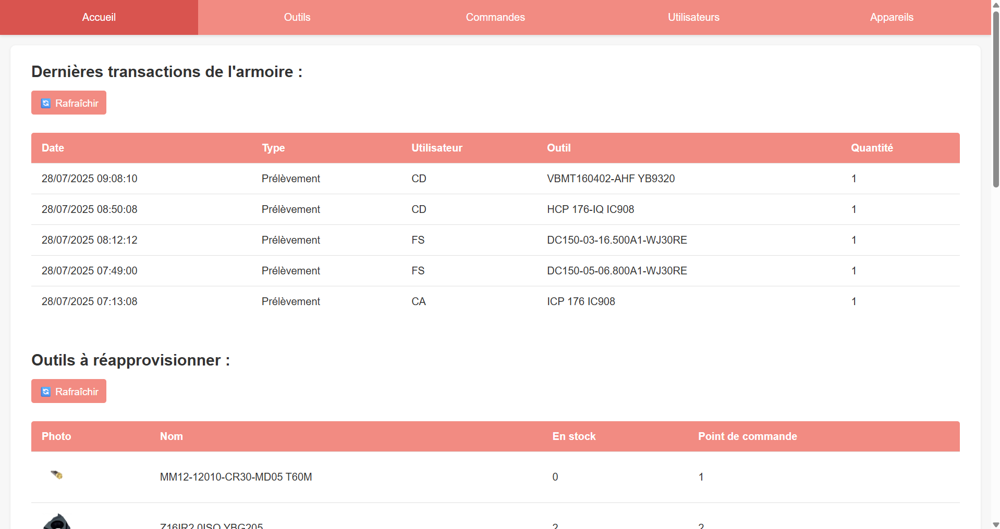
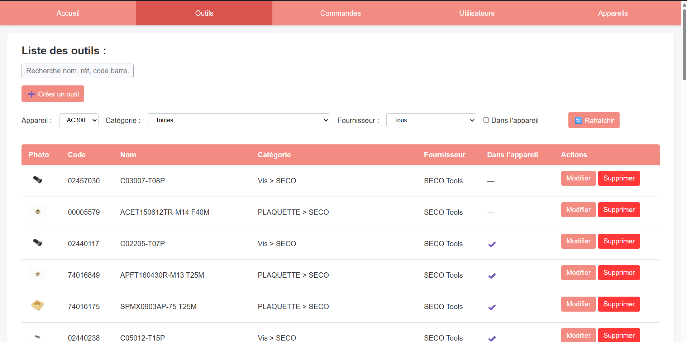
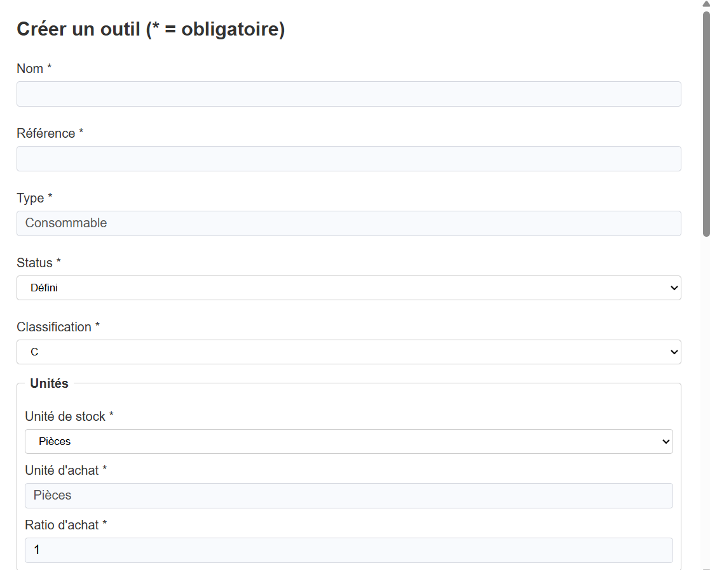
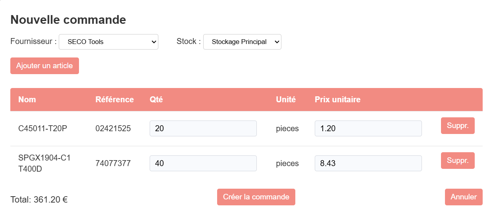
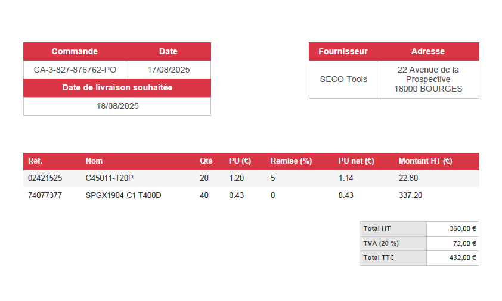
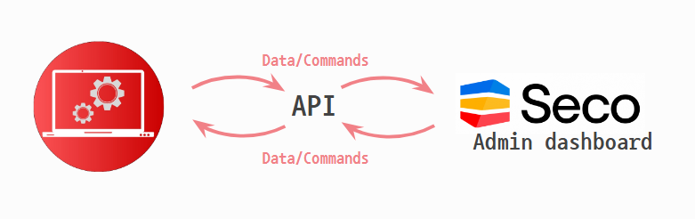

# SimpliDash


Desktop software for managing and monitoring an intelligent tool storage cabinet, developed independently (design → implementation → deployment) during my third-year work-study placement at BUT, for the company AMGM.

<!--
CAPTURE 1 — Main dashboard
-->


---

## 🎯 Context and objective

The software replaces an existing dashboard that was considered too complex and poorly suited to operators who are not comfortable with digital tools. SimpliDash focuses on the essentials: an intuitive interface for monitoring the real-time state of a connected tool storage cabinet, managing check-ins/check-outs, and generating purchase orders for restocking.

**Used in daily production** since it went into service.

---

## 🛠️ My role

Project carried out **entirely independently**: from architecture design to implementation, including API integration with the connected cabinet and the final deployment.

---

## ⚙️ Technical stack

| Category | Detail |
|---|---|
| Framework | Electron.js |
| Language | JavaScript |
| Frontend | HTML / CSS |
| API Communication | Axios |
| Application type | Desktop, cross-platform |

---

## 🖼️ Key features

### Real-time monitoring of the connected cabinet

<!--
CAPTURE 2 — Tools tab
-->


### Create and manage a tool

<!--
CAPTURE 3 — Tool creation form
-->


### Generate purchase orders

<!--
CAPTURE 4 — Order creation
-->


### PDF export

<!--
CAPTURE 5 — Generated PDF export
-->


---

## 🔌 Architecture & API integration

<!--
CAPTURE 6 — Architecture diagram
-->


The application communicates with the intelligent cabinet through a REST API (Axios), retrieves the status of tools in real time, and synchronizes the data displayed in the Electron interface.

---

## ▶️ Launch the project

<!--
Complete with the real installation and launch instructions
-->
```bash
# Clone the repo
git clone https://github.com/GONZALEZeDev/SimpliDash_SourceCode.git

# Install dependencies
npm install

# Launch the application in development mode
npm start
```

---

## 🔗 Links

- [Full portfolio](https://enzogonzalez-devportfoiol-websitecode-yibt-9cearzqfb.vercel.app/projects/simplidash)
- [LinkedIn](https://www.linkedin.com/in/enzo-gonzalezdev/)
